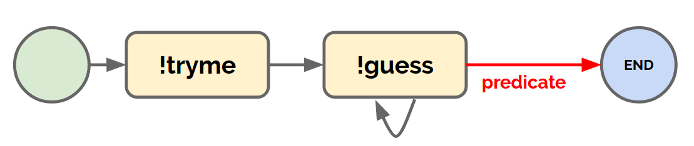

This is a simple example to show you how to create a flow with errbot.

Usage:

```
!tryme
```

It will trigger the guessing game.

You can see the structure of the flow with
```
>>> !flows show guess
Flow guess
  ⤷tryme
    ⤷guessing
       ⥀
       ⤷END
```

Graphically:




